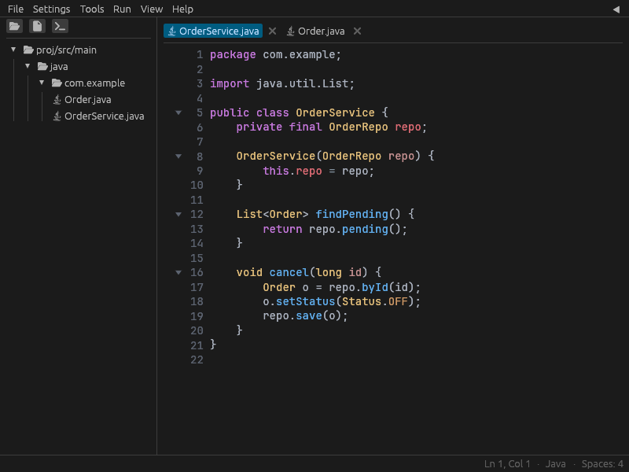
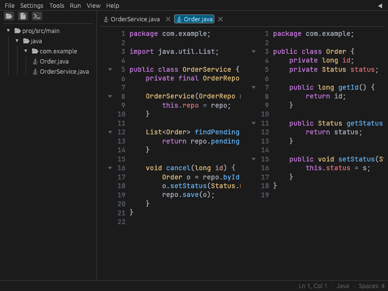

<div align="center">

# 🦊 FoxGarden

**A lightning-fast, native IDE for Java & Kotlin — written entirely in Rust.**
**Uma IDE nativa e ultrarrápida para Java & Kotlin — escrita inteiramente em Rust.**

[](LICENSE)




**[English](#-english) · [Português](#-português)**

</div>

---

## 🇬🇧 English

### What is it?

FoxGarden is a native desktop IDE for JVM projects that holds itself to
[Zed](https://zed.dev)'s bar for **startup time, input latency, and idle
resource use** — no Electron, no JVM to boot the editor itself. It grew from a
focused `.java`/`.kt` code editor into a full Spring-Boot-aware IDE: real
language servers, Maven/Gradle awareness, a debugger, git, and static analysis,
all wired into one fast UI. 🚀

> 💡 The editor is pure Rust ([`egui`](https://github.com/emilk/egui) +
> [`tree-sitter`](https://tree-sitter.github.io) + [`ropey`](https://github.com/cessen/ropey)).
> Language intelligence comes from real tools it drives out-of-process
> (jdt.ls, kotlin-language-server, Maven/Gradle, DAP, Checkstyle/PMD/SpotBugs).

### ✨ Highlights

| | |
|---|---|
| 🧠 **Language intelligence** | Diagnostics, hover, go-to-definition, find-references, rename, **quick-fix (Alt+Enter)** and peek — via jdt.ls & kotlin-language-server |
| 📦 **Build-tool aware** | Maven & Gradle classpath resolution and project Java-version detection; build / run / test from the Run menu |
| 🐞 **Debugger** | Breakpoints, call stack, variables and stepping over the Debug Adapter Protocol |
| 🌱 **Spring-aware** | Endpoint map, `application.properties`/`.yml` autocomplete, annotation completion with auto-import |
| 🔀 **Git built in** | Diff gutter, inline blame, stage / commit / push, per-hunk staging |
| 🔎 **Static analysis** | Checkstyle, PMD & SpotBugs — installable from inside the app |
| ✂️ **Split-pane editing** | Two editor panes side by side over one project, each with its own tabs |
| ⚡ **Fast by design** | Incremental parsing, per-tab galley cache, near-release-speed debug builds |

<details>
<summary><b>📋 Full feature list</b> (click to expand)</summary>

**Editing**
- Multi-cursor (`Ctrl+D`), `Alt+Click` extra cursors, rectangular (block) selection & paste
- Auto-indent, auto-closing pairs, wrap-selection, smart Home
- Comment toggle (`Ctrl+/`), join lines (`Ctrl+J`), move/duplicate lines (`Alt+↑/↓`)
- Sort / unique / case-conversion, expand-selection by syntax node (`Ctrl+W`)
- Code completion (word, keyword, dot, live templates), code folding
- Occurrence & bracket-pair highlighting, auto-save

**Navigation & project**
- Project tree with create/rename/delete, cut/copy/paste, **multi-select**
- Fuzzy Go-to-File (`Ctrl+P`), recent files (`Ctrl+E`), command palette (`Ctrl+Shift+P`)
- Tabs with dirty tracking, reopen-closed (`Ctrl+Shift+T`), read-only toggle
- Session persistence, transparent external-change reload with conflict banner
- Integrated terminal, file history (local snapshots)

**JVM tooling**
- LSP (jdt.ls / kotlin-language-server), Maven/Gradle awareness, DAP debugger
- Build / run / test, code-coverage overlay, Docker run, JDK registry
- New-project scaffolding (Maven or Gradle, **Java or Kotlin**)
- Java code generation: getters/setters, constructor, `toString`, `equals`/`hashCode`, `@Override`

**Look & feel**
- Light/dark themes, selectable font, zen mode (`F11`), sticky scroll
- Syntax highlighting for Java, Kotlin, YAML, XML, `.properties`, Dockerfile
- Bilingual UI (English / Português)

</details>

### ✂️ Split-pane editing



Split the editor with **View ▸ Split Editor** (or `Ctrl+\`). Both panes share the
one project and tab pool, but each keeps its own active tab — edit two files, or
two parts of one file, side by side.

### 🛠️ Build & run

```bash
# clone
git clone https://github.com/romulofer/foxgarden.git
cd foxgarden

# run (debug builds are near-release speed for dependencies)
cargo run --release

# tests
cargo test --workspace
```

**Requirements:** a recent Rust toolchain (edition 2024). Java language features
need a **JDK 21+** for jdt.ls to run against (any JDK can be *targeted* per
project). Build/run and static-analysis tools are auto-detected or installable
from inside the app.

### 📈 Status

Actively developed on the `ide-henshin` branch. The editor core and the JVM
tooling above are shipped and working; ongoing work is deepening LSP coverage,
split-pane polish, and profiler integration. Contributions and issues welcome. 🙌

### 📄 License

[MIT](LICENSE) © Rômulo Fernandes Evangelista

---

## 🇧🇷 Português

### O que é?

FoxGarden é uma IDE desktop nativa para projetos JVM que se cobra o mesmo padrão
do [Zed](https://zed.dev) em **tempo de inicialização, latência de digitação e
uso de recursos em repouso** — sem Electron, sem JVM para subir o próprio editor.
Começou como um editor focado em `.java`/`.kt` e virou uma IDE com consciência de
Spring Boot: language servers de verdade, conhecimento de Maven/Gradle, depurador,
git e análise estática, tudo em uma UI rápida. 🚀

> 💡 O editor é Rust puro ([`egui`](https://github.com/emilk/egui) +
> [`tree-sitter`](https://tree-sitter.github.io) + [`ropey`](https://github.com/cessen/ropey)).
> A inteligência de linguagem vem de ferramentas reais que ele controla fora do
> processo (jdt.ls, kotlin-language-server, Maven/Gradle, DAP, Checkstyle/PMD/SpotBugs).

### ✨ Destaques

| | |
|---|---|
| 🧠 **Inteligência de linguagem** | Diagnósticos, hover, ir-para-definição, referências, renomear, **correção rápida (Alt+Enter)** e espiar — via jdt.ls & kotlin-language-server |
| 📦 **Consciente do build** | Resolução de classpath Maven & Gradle e detecção da versão de Java do projeto; compilar / executar / testar pelo menu Executar |
| 🐞 **Depurador** | Breakpoints, pilha de chamadas, variáveis e stepping via Debug Adapter Protocol |
| 🌱 **Consciente de Spring** | Mapa de endpoints, autocomplete de `application.properties`/`.yml`, completar anotações com auto-import |
| 🔀 **Git embutido** | Marcadores de diff, blame na linha, stage / commit / push, stage por hunk |
| 🔎 **Análise estática** | Checkstyle, PMD & SpotBugs — instaláveis de dentro do app |
| ✂️ **Edição em painéis** | Dois painéis lado a lado sobre um projeto, cada um com suas abas |
| ⚡ **Rápido por projeto** | Parsing incremental, cache de galley por aba, builds de debug em velocidade quase-release |

<details>
<summary><b>📋 Lista completa de recursos</b> (clique para expandir)</summary>

**Edição**
- Multi-cursor (`Ctrl+D`), cursores extras com `Alt+Click`, seleção/colagem retangular (bloco)
- Auto-indentação, fechamento automático de pares, envolver seleção, Home inteligente
- Alternar comentário (`Ctrl+/`), juntar linhas (`Ctrl+J`), mover/duplicar linhas (`Alt+↑/↓`)
- Ordenar / únicas / conversão de caixa, expandir seleção por nó de sintaxe (`Ctrl+W`)
- Completar código (palavra, keyword, ponto, live templates), dobramento de código
- Destaque de ocorrências e de pares de parênteses, salvamento automático

**Navegação & projeto**
- Árvore do projeto com criar/renomear/excluir, recortar/copiar/colar, **multisseleção**
- Ir-para-arquivo fuzzy (`Ctrl+P`), arquivos recentes (`Ctrl+E`), paleta de comandos (`Ctrl+Shift+P`)
- Abas com controle de alterações, reabrir fechada (`Ctrl+Shift+T`), alternar somente-leitura
- Persistência de sessão, recarga transparente de alteração externa com banner de conflito
- Terminal integrado, histórico de arquivo (snapshots locais)

**Ferramental JVM**
- LSP (jdt.ls / kotlin-language-server), consciência Maven/Gradle, depurador DAP
- Compilar / executar / testar, cobertura de código, execução Docker, registro de JDKs
- Scaffolding de novo projeto (Maven ou Gradle, **Java ou Kotlin**)
- Geração de código Java: getters/setters, construtor, `toString`, `equals`/`hashCode`, `@Override`

**Aparência**
- Temas claro/escuro, fonte selecionável, modo zen (`F11`), rolagem fixa
- Realce de sintaxe para Java, Kotlin, YAML, XML, `.properties`, Dockerfile
- Interface bilíngue (English / Português)

</details>

### ✂️ Edição em painéis


Divida o editor com **Exibir ▸ Dividir Editor** (ou `Ctrl+\`). Os dois painéis
compartilham o mesmo projeto e conjunto de abas, mas cada um mantém sua aba ativa
— edite dois arquivos, ou duas partes do mesmo arquivo, lado a lado.

### 🛠️ Compilar & executar

```bash
# clonar
git clone https://github.com/romulofer/foxgarden.git
cd foxgarden

# executar (builds de debug rodam dependências em velocidade quase-release)
cargo run --release

# testes
cargo test --workspace
```

**Requisitos:** uma toolchain Rust recente (edição 2024). Recursos de Java exigem
um **JDK 21+** para o jdt.ls rodar (qualquer JDK pode ser *alvo* por projeto). As
ferramentas de build/run e análise estática são detectadas automaticamente ou
instaláveis de dentro do app.

### 📈 Status

Em desenvolvimento ativo na branch `ide-henshin`. O núcleo do editor e o
ferramental JVM acima já estão prontos e funcionando; o trabalho atual aprofunda
a cobertura de LSP, o polimento dos painéis e a integração de profiler.
Contribuições e issues são bem-vindas. 🙌

### 📄 Licença

[MIT](LICENSE) © Rômulo Fernandes Evangelista
